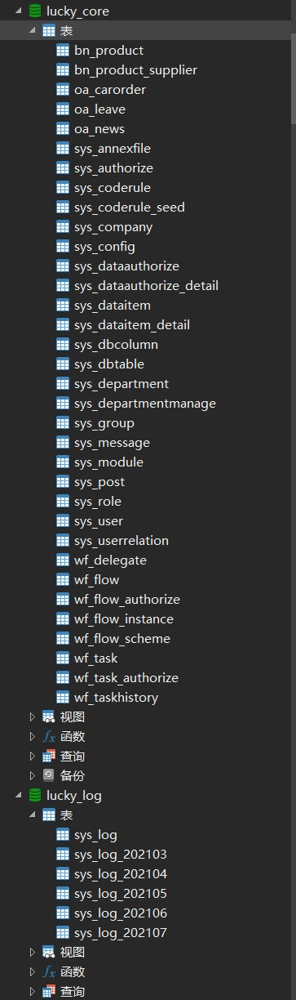

# Luckyu.V1

## 介绍
.Net Core 3.1 后台管理框架    
企业内部权限管理系统基本框架    
支持多公司 多部门 多岗位 划分,数据权限灵活配置, 项目分模块开发    
支持动态工作流设计, 工作流分版本    
支持动态数据权限配置    

菜单搜索与换肤  


列表标题栏搜索  


自定义数据权限分配  


数据字典  


审批流程设计  


审批操作（协办、待办）  


完整日志系统  


手机版页面  


## 说明
基于 Layui 后台框架, 整合了许多第三方插件如 jqgrid eletree xmselect等
仅作为学习尝试, 如有侵权, 可联系删除

  
数据库 MySql  日志库与业务主库分离, 日志库自动分表
ORM FreeSql  
前台框架 Layui   
缓存 Redis 与 MemoryCache 可切换  
利用 SingnalIR 实时推送消息  

## 分模块开发
采取分项目,分模块开发
Luckyu.Web为主启动项目
各功能模块以 Luckyu.Module 开头 


★★★重点★★★
各项目模块 新建项目类型为 RCL (Razor Class Library)
需要在.csproj文件中做如下配置

指定 dll 输出路径
```
<PropertyGroup Condition="'$(Configuration)|$(Platform)'=='Debug|AnyCPU'">
<OutputPath>..\Luckyu.Web\bin\$(Configuration)\</OutputPath>
</PropertyGroup>
<PropertyGroup Condition="'$(Configuration)|$(Platform)'=='Release|AnyCPU'">
<OutputPath>..\Luckyu.Web\bin\$(Configuration)\</OutputPath>
</PropertyGroup>
```

复制 Areas 文件夹下静态文件
```
<ItemGroup>
<None Include="Areas\**\*.js">
    <CopyToOutputDirectory>PreserveNewest</CopyToOutputDirectory>
</None>
<None Include="Areas\**\*.css">
    <CopyToOutputDirectory>PreserveNewest</CopyToOutputDirectory>
</None>
</ItemGroup>

```

☆☆☆有关发布的说明☆☆☆
发布时请务必设置 VS 编译模式为 Release , 发布 Web 项目, 并且在 Release 模式下生成所有Module ,复制web/bin/release目录下所有dll覆盖发布文件dll,代码中目前有需要方便调试的判断都是根据 vs debug  release 模式写的,后期考虑做成动态配置文件

## 已有模块
### 组织机构  
公司管理   
部门管理   
小组管理   
角色管理   
岗位管理   
用户管理   
菜单管理   
用户权限管理   

### 系统设置     
数据字典分类    
数据字典编辑-管理员    
数据字典编辑-用户    
编码规则生成  
系统日志  
通知消息 - 利用SingnalIR给指定用户推送通知 

### 流程管理    
流程设计    
我的任务 - 发起的任务 待办任务 已办任务   
流程监控 - 强制结束运行中的流程,调整当前待办任务到任意节点位置,并且可以切换流程版本,管理员模拟自动通过流程审批   
任务委托 - 指定时间段内指定模块审批任务交给指定人待批, 用于出差 请假时   

### 办公管理    
通知管理    
请假管理 - 目前用于测试流程   

### 下一步计划  
手机版页面多做一些功能，尽量每种控件都试试，以后好搭建小程序什么的

办公系统里面可以集成一些实用小功能，也可以试着调用一些外网接口，技术储备吧  
1、在线编辑office文档

自定义表单（这个得好好想想，不忙着弄，有很多东西）
用户通过界面自定义创建表单，填写数据、保存，修改，配置工作流，自动统计。

## 更新日志  
### 2022-3-28  
增加流程节点超时自动审批/退回设置

### 2022-3-22
修改调整当前待办流程节点时，可以选择默认用户，亦可以自由选择调整给其他人办理  
登录验证码改为密码输入错误两次之后再填写，第一次登录不填写  
Jqgrid字符串通用查询 等于 不等于 包含 不包含等等

### 2022-3-17  
eleTree升级到2.0

### 2022-1-26
流程历史增加待办时间与办结时间，可以计算出办理滞留时间
流程实例增加最后办结人与最后办结时间字段

### 2021-12-2
转发、加签可以填写意见 
已结束流程也可以调整（找到最后实例，结束标志改为未结束，增加待办）  
增加管理员流程挂起（流程实例留着，但是所有待办删除） 
每步审批可以看到下步审批节点与审批人，并且如果有所设置，则下步审批节点与审批人都可选择（但目前第一步提交还不能选择，稍后完善）

### 2021-10-22
完善流程，拒绝如果有下一步就往下走，如果没有下一步就直接结束流程，不用划线到结束了

### 2021-8-28
修复bug

### 2021-8-16  
增加代码自动生成

### 2021-8-4  
修复部分bug，处理了表格排序字段可能被sql注入的问题

### 2021-7-22
修改了加签，加签多人时，必须多人全部通过流程才会继续向下

### 2021-7-6
优化了多公司、多部门
优化流程

### 2021-7-1
审批时增加附件上传，手机版也同步加上了
流程监控，调整流程，增加删除协办、代办人员的功能，增加删除审批历史记录功能

### 2021-6-25
修复审批相关BUG
小优化，当Layer弹框最小化后，可以打开其他的，多页面共存

### 2021-6-22
审批时增加上传附件
弹框最小化，可以打开多个

### 2021-6-20
审批修改原本加签为代办，即为把当前自己的审批任务让渡给他人
审批增加协办功能，即为自己待办审批期间，可以选择协办人，审批流程中会插入协办人待办任务，但协办人不管同意与否，流程并不向下流转，而是协办人办结后，当前审批人可以看到协办人意见，根据意见作出审批决断，此时流程才会向下流转。
注：不管代办、协办，增加人员之后，当前审批人依旧可以无视增加人直接批准。
审批驳回，增加选项，可以选择驳回至起始，或是驳回至上一步
手机审批同步增加代办、协办、驳回上一步功能。

### 2021-6-7
修复任务委托的bug

### 2021-6-1
手机审批后台也写好了

### 2021-5-9 
手机审批页面做好了，稍后来写后台逻辑

### 2021-4-21 
通用打印页面增加导出Excel

### 2021-4-21 
增加通用打印页面，使用HTML页面打印，暂时没有好用的报表
手机页面完成登录页、主页、列表页，还差审批页和表单页了


